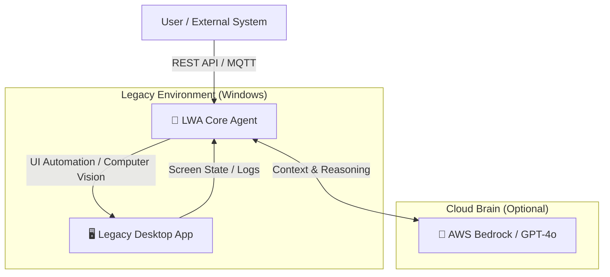

# 🤖 Legacy Wrapper Agent (LWA)
### Turning "Legacy Desktop Apps" into "Modern AI Agents" 🚀

<div align="center">


**Bridging the gap between 20-year-old Legacy Systems and Cutting-Edge AI.** *Automate the Unautomatable.*

[Demo Video (Coming Soon)] | [Documentation](#) | [Report Bug](../../issues)

</div>

---

## 📖 Overview

**LWA (Legacy Wrapper Agent)** is a specialized automation layer designed for **Port Logistics & Enterprise Legacy Systems**.

Many critical industries (Logistics, Manufacturing, Healthcare) still rely on legacy **VB.NET / WinForms / MFC** applications that lack modern APIs. Rewriting them is costly and risky.

**LWA solves this by wrapping the legacy UI with an AI-driven control layer**, enabling:
- **Zero-Code Integration:** Control desktop apps without modifying their source code.
- **AI-Native Interface:** Interact with legacy apps using Natural Language (via AWS Bedrock / OpenAI).
- **Autonomous Recovery:** AI detects UI errors and retries operations automatically.

---

## 🏗 Architecture

LWA does not just "click buttons". It understands the UI structure.



---

## ✨ Key Features

* **🛡 Non-Intrusive Automation** Uses **UI Automation API (FlaUI)** to interact with standard Windows controls. No database hacking required.
* **🧠 AI Semantic Understanding** Unlike traditional RPA (coordinate-based), LWA identifies buttons/forms by "Meaning" (e.g., "Find the 'Submit' button").
* **🔌 Modern API Gateway** Exposes legacy functionality as **REST / gRPC / MQTT** endpoints.
* *Example:* `POST /api/inventory/update` -> LWA types into the legacy form -> Returns JSON.


* **⚓️ Port-Tech Specialized** Optimized for high-reliability environments like Vessel Operations & Container Inventory.

---

## 🚀 Getting Started

### Prerequisites

* Windows 10/11 or Windows Server 2019+
* .NET 9.0 SDK
* Target Legacy Application (e.g., Notepad, Custom VB App)

### Production Configuration (Required)

Set the following environment variables before starting `LWA.Agent`:

* `LWA_API_KEY` (required): API key expected in `X-API-Key` request header
* `LWA_SQS_URL` (required): SQS queue URL for command polling
* `LWA_AWS_REGION` (recommended): AWS region (example: `ap-northeast-1`)
* `LWA_ACCESS_KEY` + `LWA_SECRET_KEY` (optional pair): static credentials if IAM role is not used
* `LWA_ALLOWED_ORIGINS` (required): comma-separated CORS allowlist (example: `https://ops.example.com,https://admin.example.com`)

### Installation

```bash
# Clone the repository
git clone [https://github.com/EGAMIJUN/LWA-Workspace.git](https://github.com/EGAMIJUN/LWA-Workspace.git)

# Navigate to the project
cd LWA-Workspace

# Restore dependencies
dotnet restore

```

### Usage (Example)

1. Configure the `appsettings.json` to point to your target executable path.
2. Run the Agent:

```bash
dotnet run --project src/LWA.Agent

```

3. Send a command via HTTP:

```bash
curl -X POST http://localhost:5000/api/command \
   -H "Content-Type: application/json" \
   -d '{"instruction": "Open the inventory screen and search for Container #8822"}'

```

---

## 🛠 Tech Stack

* **Core:** C# / .NET 9
* **Automation:** Microsoft UI Automation / FlaUI / OpenCV
* **AI Integration:** AWS SDK (Bedrock), Semantic Kernel
* **Communication:** MQTT, ASP.NET Core WebAPI

---

## 🔮 Roadmap

* [x] Basic UI Automation Wrapper
* [ ] **Phase 2:** Vision-based Control (using GPT-4o Vision for non-standard UIs)
* [ ] **Phase 3:** Autonomous Error Recovery
* [ ] **Phase 4:** Multi-Agent Orchestration (GodScheduler Integration)

---

## 🤝 Contributing

Contributions are welcome! Please read the [contribution guidelines](../../issues) first.

## 👤 Author

**Jun Egami** *Port-Tech Architect & LWA Founder* [GitHub Profile](https://github.com/EGAMIJUN)

---
